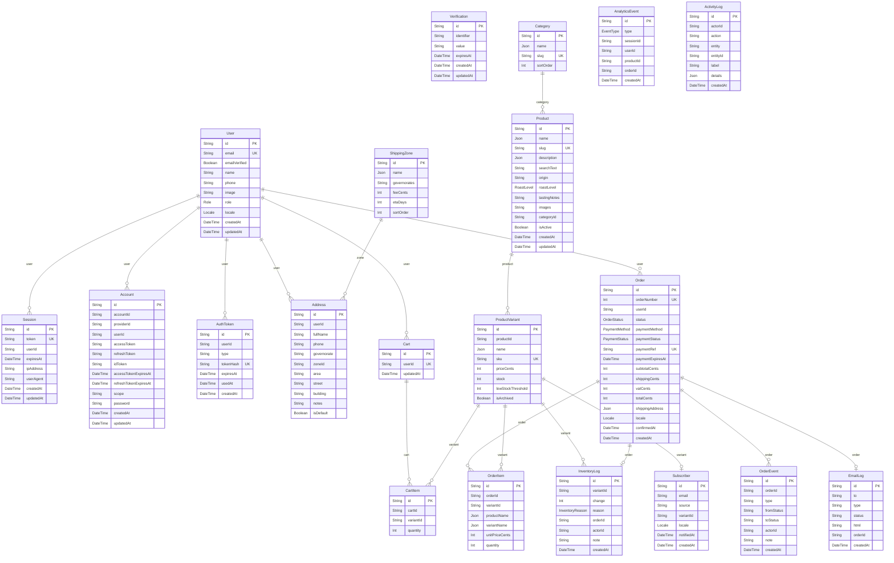

# Entity relationship diagram

Generated from `prisma/schema.prisma` by `npm run docs:erd`. Do not edit by hand.

```mermaid
erDiagram
  User {
    String id PK
    String email UK
    Boolean emailVerified
    String name
    String phone
    String image
    Role role
    Locale locale
    DateTime createdAt
    DateTime updatedAt
  }
  Session {
    String id PK
    String token UK
    String userId
    DateTime expiresAt
    String ipAddress
    String userAgent
    DateTime createdAt
    DateTime updatedAt
  }
  Account {
    String id PK
    String accountId
    String providerId
    String userId
    String accessToken
    String refreshToken
    String idToken
    DateTime accessTokenExpiresAt
    DateTime refreshTokenExpiresAt
    String scope
    String password
    DateTime createdAt
    DateTime updatedAt
  }
  Verification {
    String id PK
    String identifier
    String value
    DateTime expiresAt
    DateTime createdAt
    DateTime updatedAt
  }
  AuthToken {
    String id PK
    String userId
    String type
    String tokenHash UK
    DateTime expiresAt
    DateTime usedAt
    DateTime createdAt
  }
  ShippingZone {
    String id PK
    Json name
    String governorates
    Int feeCents
    Int etaDays
    Int sortOrder
  }
  Address {
    String id PK
    String userId
    String fullName
    String phone
    String governorate
    String zoneId
    String area
    String street
    String building
    String notes
    Boolean isDefault
  }
  Category {
    String id PK
    Json name
    String slug UK
    Int sortOrder
  }
  Product {
    String id PK
    Json name
    String slug UK
    Json description
    String searchText
    String origin
    RoastLevel roastLevel
    String tastingNotes
    String images
    String categoryId
    Boolean isActive
    DateTime createdAt
    DateTime updatedAt
  }
  ProductVariant {
    String id PK
    String productId
    Json name
    String sku UK
    Int priceCents
    Int stock
    Int lowStockThreshold
    Boolean isArchived
  }
  Cart {
    String id PK
    String userId UK
    DateTime updatedAt
  }
  CartItem {
    String id PK
    String cartId
    String variantId
    Int quantity
  }
  Order {
    String id PK
    Int orderNumber UK
    String userId
    OrderStatus status
    PaymentMethod paymentMethod
    PaymentStatus paymentStatus
    String paymentRef UK
    DateTime paymentExpiresAt
    Int subtotalCents
    Int shippingCents
    Int vatCents
    Int totalCents
    Json shippingAddress
    Locale locale
    DateTime confirmedAt
    DateTime createdAt
  }
  OrderItem {
    String id PK
    String orderId
    String variantId
    Json productName
    Json variantName
    Int unitPriceCents
    Int quantity
  }
  OrderEvent {
    String id PK
    String orderId
    String type
    String fromStatus
    String toStatus
    String actorId
    String note
    DateTime createdAt
  }
  InventoryLog {
    String id PK
    String variantId
    Int change
    InventoryReason reason
    String orderId
    String actorId
    String note
    DateTime createdAt
  }
  Subscriber {
    String id PK
    String email
    String source
    String variantId
    Locale locale
    DateTime notifiedAt
    DateTime createdAt
  }
  AnalyticsEvent {
    String id PK
    EventType type
    String sessionId
    String userId
    String productId
    String orderId
    DateTime createdAt
  }
  EmailLog {
    String id PK
    String to
    String type
    String status
    String html
    String orderId
    DateTime createdAt
  }
  ActivityLog {
    String id PK
    String actorId
    String action
    String entity
    String entityId
    String label
    Json details
    DateTime createdAt
  }
  User ||--o{ Session : "user"
  User ||--o{ Account : "user"
  User ||--o{ AuthToken : "user"
  User ||--o{ Address : "user"
  ShippingZone ||--o{ Address : "zone"
  Category ||--o{ Product : "category"
  Product ||--o{ ProductVariant : "product"
  User ||--o{ Cart : "user"
  Cart ||--o{ CartItem : "cart"
  ProductVariant ||--o{ CartItem : "variant"
  User ||--o{ Order : "user"
  Order ||--o{ OrderItem : "order"
  ProductVariant ||--o{ OrderItem : "variant"
  Order ||--o{ OrderEvent : "order"
  ProductVariant ||--o{ InventoryLog : "variant"
  Order ||--o| InventoryLog : "order"
  ProductVariant ||--o| Subscriber : "variant"
  Order ||--o| EmailLog : "order"
```
